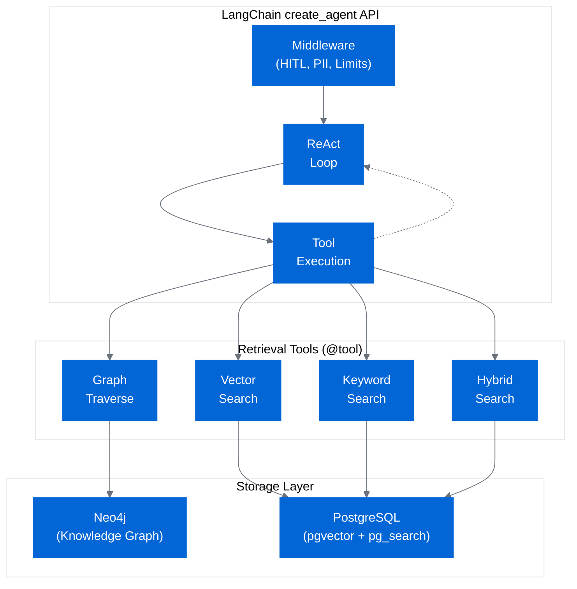

# Agentic GraphRAG for Test Scope Analysis

[](https://github.com/Berkay2002/agentic-rag-test-scope-analysis)
[](LICENSE)
[](https://www.python.org/downloads/)
[](https://github.com/psf/black)
[](https://github.com/astral-sh/ruff)

> **Master's Thesis Research Project**  
> Conducted in collaboration with **Ericsson**  
> Linköping University, 2024-2025

A research implementation of an agentic Retrieval-Augmented Generation (RAG) system combining Knowledge Graphs, Vector Search, and Human-in-the-Loop workflows for test scope analysis in telecommunications software systems.

## ⚠️ Academic Research Project

This repository contains the implementation for a Master's Thesis. The code is made publicly available for:
- Academic transparency and reproducible research
- Peer review and thesis evaluation
- Educational purposes and research community benefit

**Important**: This is a research artifact, not a production-ready commercial product. See [LICENSE](LICENSE), [DISCLAIMER.md](DISCLAIMER.md), and [CONTRIBUTING.md](CONTRIBUTING.md) for usage terms and restrictions.

## Overview

This system implements a comprehensive agentic RAG architecture that addresses three key research questions:

- **RQ1**: What Knowledge Graph ontology effectively represents software engineering entities and relationships for test scope analysis?
- **RQ2**: How do different retrieval strategies (vector, keyword, graph, hybrid) compare for test-related queries?
- **RQ3**: How can Human-in-the-Loop (HITL) agent workflows improve retrieval quality and user control?

## Key Features

### Agent & Orchestration
- **LangChain create_agent API**: Modern high-level agent API with built-in middleware support
- **HITL Workflows**: PostgresSaver checkpointing for human intervention and tool approval
- **Middleware Support**: Built-in ModelCallLimit, ToolCallLimit, HumanInTheLoop, and PII detection middleware
- **LangSmith Integration**: Full observability and debugging
- **Gemini Thinking Configuration**: Adjustable reasoning depth (low/medium/high/dynamic) via CLI commands

### Storage & Retrieval
- **Dual Storage Architecture**: Neo4j (knowledge graph) + PostgreSQL (pgvector + pg_search BM25)
- **4 Retrieval Tools** (using @tool decorator pattern with factory functions):
  - Vector Search (pgvector semantic similarity)
  - Keyword Search (pg_search BM25 lexical matching)
  - Graph Traversal (Neo4j Cypher queries)
  - Hybrid Search (RRF fusion of vector + keyword)

### Document Loading & Processing
- **AI-Powered Document Parsing**: Docling integration (15+ formats)
  - DocLayNet layout analysis (IBM Research AI model)
  - TableFormer for table structure recognition
  - HybridChunker for semantic chunking
- **AST-Based Code Parsing**: Tree-sitter for structure-aware code analysis
  - Extract functions, classes, methods with full context
  - Preserve parent-child relationships and docstrings
  - Multi-language support (Python, Java, etc.)
- **TGF (Test Governance Framework) Loader**: CSV loader for Ericsson test execution results
  - Parses TGF CSV format with test metadata
  - Maps to TestCase entities with relationships
  - Validates and normalizes test results and types
- **Dual Storage Writer**: Coordinated writes to Neo4j + PostgreSQL + BM25
  - Retry logic with exponential backoff
  - Idempotent upserts for reliability

### Evaluation
- **Comprehensive Metrics**: Precision@k, Recall@k, MAP, MRR, F1@k
- **Agentic Evaluation Framework**: Full agent pipeline testing with dynamic strategy comparison
- **Multi-Strategy Comparison**: Evaluate vector, keyword, hybrid, graph, and agent strategies
- **Entity Extraction**: Automatic extraction of entity IDs from agent responses
- **Tool Usage Tracking**: Monitor tool selection patterns and execution statistics

## Architecture



## Installation

### Prerequisites

- Python 3.11+
- Neo4j 5.20+ (with APOC plugin for graph operations)
- PostgreSQL 15+ with pgvector and pg_search extensions
- Poetry 1.8+

### Setup

1. Clone the repository:
```bash
git clone <repository-url>
cd agentic-rag-test-scope-analysis
```

2. Install dependencies with Poetry:
```bash
poetry install
```

3. Create environment file:
```bash
cp .env.example .env
# Edit .env with your API keys and database credentials
```

4. Initialize database schemas:
```bash
poetry run agrag init
```

## Configuration

See `.env.example` for all configuration options. Key settings:

- `GOOGLE_API_KEY`: Required for LLM and embeddings
- `NEO4J_URI`, `NEO4J_PASSWORD`: Neo4j connection
- `NEON_CONNECTION_STRING`: PostgreSQL/Neon connection
- `LANGCHAIN_API_KEY`: Optional, for LangSmith tracing

## Usage

### CLI Commands

#### Interactive Chat (Recommended)
```bash
# Start interactive chat mode (like Claude Code, Copilot CLI)
# Safe by default - you approve each tool before execution
poetry run agrag chat

# Resume a previous conversation
poetry run agrag chat --thread-id my-session

# YOLO mode - autonomous execution without approvals (use with caution)
poetry run agrag chat --yolo
```

The interactive chat mode provides a conversational interface with:
- Natural language conversation
- **Automatic conversation persistence** (resume anytime)
- Real-time streaming responses with progress indicators
- Built-in commands (`/help`, `/stats`, `/exit`, etc.)
- **Safe by default** - you approve each tool execution (HITL mode)

**Modes:**
- **Default (Safe Mode)**: Agent asks for approval before each tool execution
  - ✅ You control everything, safer, better for learning
  - Best for: normal usage, exploring, sensitive data
  
- **YOLO Mode** (`--yolo`): Agent executes autonomously without asking
  - ⚡ Faster but uncontrolled
  - Best for: trusted workflows, demos, when you're confident

**Available chat commands:**
- `/help` - Show help
- `/clear` - Clear screen
- `/history` - View conversation history
- `/stats` - Show session statistics (messages, tool calls, duration)
- `/reset` - Start new conversation
- `/save` - Save conversation to file
- `/thinking [preset]` - Adjust Gemini thinking budget (`low`, `medium`, `high`, `dynamic`, or integer tokens)
- `/exit` or `/quit` - Exit chat

#### Query the System
```bash
# Single query (non-interactive)
poetry run agrag query "What tests cover requirement REQ_AUTH_005?"

# With streaming output
poetry run agrag query "Find handover-related test cases" --stream

# With HITL checkpointing
poetry run agrag query "Show dependencies for TestLoginTimeout" --checkpoint --thread-id my-session
```

#### Load Documents and Code
```bash
# Load documents with Docling (AI-powered parsing)
poetry run agrag load docs /path/to/requirements --use-chunker

# Load with specific formats and options
poetry run agrag load docs /path/to/docs \
  --formats pdf,docx,xlsx \
  --use-chunker \
  --table-mode accurate \
  --max-pages 100

# Load code repository
poetry run agrag load repo /path/to/repository --languages python

# Load with filtering
poetry run agrag load repo /path/to/repo \
  --languages python,java \
  --include "src/**/*.py" \
  --exclude "tests/**"

# Show loading statistics
poetry run agrag load stats
```

#### Data Management
```bash
# Generate synthetic test data
poetry run agrag generate --requirements 50 --testcases 200

# Generate with evaluation dataset
poetry run agrag generate --requirements 50 --testcases 200 --with-eval

# Generate and immediately ingest (resets databases first)
poetry run agrag generate --requirements 50 --testcases 200 --ingest

# Ingest data into databases
poetry run agrag ingest data/synthetic_dataset.json
```

#### Initialize Databases
```bash
poetry run agrag init
```

#### Run Evaluation
```bash
# Evaluate all strategies on a dataset
poetry run agrag evaluate --dataset data/eval_queries.json --output results.json

# Evaluate specific strategy
poetry run agrag evaluate --dataset data/eval_queries.json --strategy vector

# Evaluate the full agent with dynamic tool selection (RQ2)
poetry run agrag evaluate --dataset data/eval_queries.json --strategy agent

# Evaluate with verbose per-query metrics
poetry run agrag evaluate --dataset data/eval_queries.json --strategy all --verbose
```

#### Show Configuration
```bash
poetry run agrag info
```

### Programmatic Usage

```python
from agrag.core import create_agent_graph, create_initial_state

# Create agent with default settings
graph = create_agent_graph()

# Create agent with middleware configuration
from agrag.middleware import get_pii_middleware

graph = create_agent_graph(
    middleware=get_pii_middleware(),  # Optional PII protection
    max_model_calls=10,               # Limit model invocations
    max_tool_calls=20,                # Limit tool executions
    enable_hitl=True,                 # Enable human-in-the-loop
)

# Run query
initial_state = create_initial_state("Find tests for handover failures")
result = graph.invoke(initial_state)

print(result["final_answer"])
```

## Knowledge Graph Ontology

The system uses a custom ontology for software engineering entities:

### Entity Types
- **Requirement**: System requirements with priorities
- **TestCase**: Test cases (unit, integration, protocol, etc.)
- **Function**: Code functions with signatures
- **Class**: Code classes with methods
- **Module**: Code modules/packages

### Relationship Types
- **VERIFIES**: TestCase → Requirement
- **COVERS**: TestCase → Function/Class
- **CALLS**: Function → Function
- **DEFINED_IN**: Function/Class → Module
- **INHERITS_FROM**: Class → Class
- **DEPENDS_ON**: Requirement → Requirement

## Retrieval Tools

### 1. Vector Search
Semantic search using PostgreSQL pgvector (HNSW index, 768-dim embeddings, cosine similarity).

**Best for:**
- Conceptual queries
- Finding semantically similar content
- Understanding meanings and intent

**Example:**
```python
from agrag.tools import create_vector_search_tool
from agrag.storage import PostgresClient

postgres_client = PostgresClient()

tool = create_vector_search_tool(postgres_client)
result = tool.invoke({
    "query": "tests related to handover failures",
    "k": 10,
    "node_type": "TestCase"
})
```

### 2. Keyword Search
Lexical search using BM25 (Best Matching 25) probabilistic ranking algorithm via PostgreSQL FTS.

**Best for:**
- Exact keyword matches
- Specific identifiers (test IDs, function names)
- Error codes and technical terms

**Example:**
```python
from agrag.tools import create_keyword_search_tool
from agrag.storage import PostgresClient, BM25RetrieverManager

postgres_client = PostgresClient()
bm25_manager = BM25RetrieverManager()

tool = create_keyword_search_tool(postgres_client, bm25_manager)
result = tool.invoke({
    "query": "TestLoginTimeout",
    "k": 10
})
```

### 3. Graph Traversal
Multi-hop graph traversal for structural relationships.

**Best for:**
- Dependency analysis
- Coverage tracing
- Structural queries

**Example:**
```python
from agrag.tools import create_graph_traverse_tool
from agrag.storage import Neo4jClient
from agrag.kg.ontology import NodeLabel, RelationshipType

neo4j_client = Neo4jClient()
tool = create_graph_traverse_tool(neo4j_client)

result = tool.invoke({
    "start_node_id": "REQ_AUTH_005",
    "start_node_label": NodeLabel.REQUIREMENT,
    "relationship_types": [RelationshipType.VERIFIES],
    "depth": 2
})
```

### 4. Hybrid Search
RRF fusion of vector + keyword search.

**Best for:**
- Complex queries needing both semantic and lexical matching
- Balancing precision and recall

**Example:**
```python
from agrag.tools import create_hybrid_search_tool
from agrag.storage import PostgresClient

postgres_client = PostgresClient()

tool = create_hybrid_search_tool(postgres_client)
result = tool.invoke({
    "query": "tests for LTE signaling with timeout errors",
    "k": 10,
    "rrf_k": 60
})
```

## Evaluation

The system includes comprehensive evaluation metrics:

- **Precision@k**: Relevant items in top-k
- **Recall@k**: Coverage of relevant items
- **F1@k**: Harmonic mean of precision and recall
- **Average Precision (AP)**: Precision at each relevant position
- **Mean Average Precision (MAP)**: Average AP across queries
- **Reciprocal Rank (RR)**: Rank of first relevant item
- **Mean Reciprocal Rank (MRR)**: Average RR across queries

Example:
```python
from agrag.evaluation import evaluate_retrieval

retrieved = ["id1", "id2", "id3", "id4"]
relevant = {"id1", "id3", "id5"}

metrics = evaluate_retrieval(retrieved, relevant, k_values=[1, 3, 5, 10])
# Returns: {
#   "precision@1": 1.0,
#   "recall@1": 0.33,
#   "precision@3": 0.67,
#   ...
# }
```

## Project Structure

```
src/agrag/
├── cli/              # CLI application
│   ├── main.py       # Commands: query, chat, load, init, generate, evaluate, etc.
│   ├── interactive.py # Interactive chat interface
│   ├── display.py    # Output formatting utilities
│   ├── hitl.py       # Human-in-the-loop utilities
│   ├── thinking.py   # Gemini thinking budget configuration
│   └── commands.py   # Command handler helpers
├── config/           # Configuration and logging
├── core/             # Agent using create_agent API
│   ├── state.py      # AgentState definition
│   ├── graph.py      # create_agent_graph() with middleware support
│   └── checkpointing.py # HITL checkpointing
├── data/             # Data generation and ingestion
│   ├── generators/   # Synthetic data generation (TGF-compatible)
│   ├── loaders/      # Document and code loaders
│   │   ├── base.py           # Abstract base classes
│   │   ├── document_loader.py # Docling integration
│   │   ├── code_loader.py    # Repository walker
│   │   ├── tgf_loader.py     # TGF CSV loader for Ericsson test data
│   │   └── splitters/        # Text splitters
│   │       ├── code_splitter.py     # AST-based
│   │       ├── markdown_splitter.py # Header-based
│   │       └── semantic_splitter.py # Embeddings-based
│   ├── dual_storage_writer.py # Coordinated DB writes
│   └── ingestion.py  # Data ingestion pipeline
├── evaluation/       # Evaluation framework
│   ├── metrics.py    # P@k, R@k, MAP, MRR calculations
│   ├── agentic_evaluator.py # Full agent pipeline evaluation
│   ├── entity_extractor.py  # Extract entity IDs from responses
│   └── tool_tracker.py      # Tool usage statistics
├── kg/               # Knowledge graph ontology
├── middleware/       # Agent middleware
│   └── pii.py        # PII detection and redaction
├── models/           # LLM and embedding wrappers
├── storage/          # Database clients
│   ├── neo4j_client.py
│   ├── postgres_client.py
│   └── bm25_retriever.py
└── tools/            # Retrieval tools (@tool decorator pattern)
    ├── vector_search.py   # create_vector_search_tool()
    ├── keyword_search.py  # create_keyword_search_tool()
    ├── graph_traverse.py  # create_graph_traverse_tool()
    ├── hybrid_search.py   # create_hybrid_search_tool()
    └── schemas.py
```

## Development

### Running Tests
```bash
poetry run pytest
```

### Code Quality
```bash
# Format code
poetry run black src/ tests/

# Lint
poetry run ruff check src/ tests/

# Type checking (when enabled)
poetry run mypy src/
```

### Working with Loaders

#### Document Loading with Docling
```python
from agrag.data.loaders import DoclingDocumentLoader

# Load PDF with AI-powered parsing
loader = DoclingDocumentLoader(
    file_path="requirements.pdf",
    use_chunker=True,  # Enable semantic chunking
    table_mode="accurate",  # Use TableFormer for tables
)
documents = loader.load()

# Each document has rich metadata
for doc in documents:
    print(doc.metadata)  # headings, page_number, bbox, etc.
```

#### Code Repository Loading
```python
from agrag.data.loaders import CodeLoader

# Load Python repository
loader = CodeLoader(
    repo_path="/path/to/repo",
    languages=["python"],
    include_patterns=["src/**/*.py"],
)
code_docs = loader.load()

# Each document represents a function/class with AST metadata
for doc in code_docs:
    print(doc.metadata)  # type, name, signature, line_start, complexity, etc.
```

#### Custom Text Splitting
```python
from agrag.data.loaders.splitters import CodeSplitter, MarkdownSplitter

# AST-based code splitting
code_splitter = CodeSplitter(language="python")
functions = code_splitter.split_code(source_code)

# Header-based markdown splitting
md_splitter = MarkdownSplitter(max_chunk_size=1000)
sections = md_splitter.split_text(markdown_content)
```

#### TGF (Test Governance Framework) Loading
```python
from agrag.data.loaders import TGFLoader

# Load TGF CSV with test execution results
loader = TGFLoader("data/tgf_export.csv")
test_cases = loader.load()

# Entities include relationships to requirements and functions
for tc in test_cases:
    print(tc.to_test_case_entity())  # id, name, test_type, etc.
    print(tc.requirement_ids)  # Related requirement IDs
    print(tc.function_names)   # Functions under test
```

### Database Management

#### Dual Storage Writes
```python
from agrag.data.dual_storage_writer import DualStorageWriter

writer = DualStorageWriter()

# Write entities to Neo4j + PostgreSQL + BM25
stats = writer.write_entities_batch(
    entities=my_entities,
    entity_type="Requirement",
    batch_size=100
)

# Persist BM25 index
writer.persist_bm25_index("data/bm25_index.pkl")
```

## Research Questions

### RQ1: Knowledge Graph Ontology
The system implements a domain-specific ontology covering:
- 5 entity types (Requirement, TestCase, Function, Class, Module)
- 6 relationship types (VERIFIES, COVERS, CALLS, DEFINED_IN, INHERITS_FROM, DEPENDS_ON)
- Rich metadata (priorities, test types, signatures, etc.)
- Vector embeddings for all entities (768-dim)

### RQ2: Retrieval Strategy Comparison
Five retrieval strategies implemented and evaluated:
- **Vector Search**: Semantic similarity (PostgreSQL pgvector HNSW)
- **Keyword Search**: Lexical matching (PostgreSQL pg_search BM25)
- **Graph Traversal**: Structural relationships (Neo4j Cypher queries)
- **Hybrid Search**: RRF fusion of vector + keyword (PostgreSQL-native)
- **Agent**: Dynamic strategy selection via LLM reasoning

The agentic evaluation framework (`AgenticEvaluator`) enables:
- Full agent pipeline testing with dynamic tool selection
- Comparison of static strategies vs. agent-driven retrieval
- Tool usage pattern analysis and execution statistics
- Entity extraction from natural language responses

Evaluation framework supports comparative analysis with Precision@k, Recall@k, MAP, MRR, and F1@k.

### RQ3: HITL Workflows
LangChain create_agent API with PostgresSaver checkpointing enables:
- Conversation persistence across sessions
- Human approval before tool execution (via HumanInTheLoopMiddleware)
- State inspection and modification
- Thread-based conversation management
- Safe mode (default) vs YOLO mode for autonomous execution

## License

MIT License - see LICENSE file for details.

## Citation

If you use this work in your research, please cite:

```bibtex
@mastersthesis{agrag2025,
  author = {Berkay Orhan},
  title = {Agentic GraphRAG for Test Scope Analysis in Telecommunications Software},
  school = {Linköping University},
  year = {2025},
  note = {Master's Thesis, in collaboration with Ericsson},
  url = {https://github.com/Berkay2002/agentic-rag-test-scope-analysis}
}
```

**APA Format**:  
Orhan, B. (2025). *Agentic GraphRAG for Test Scope Analysis in Telecommunications Software* [Master's thesis, Linköping University]. GitHub. https://github.com/Berkay2002/agentic-rag-test-scope-analysis

## Acknowledgments

This research was conducted as part of a Master's Thesis program at Linköping University in collaboration with **Ericsson**.

**Special Thanks**:
- Ericsson Research Team
- Linköping University Department of Computer Science

## Support & Contact

This is an academic research project with limited ongoing maintenance.

**For academic questions or research collaboration**:
- Email: Berkayorhan@hotmail.se
- Student Email: Beror658@student.liu.se
- GitHub Discussions: https://github.com/Berkay2002/agentic-rag-test-scope-analysis/discussions

**For bug reports**:
- GitHub Issues: https://github.com/Berkay2002/agentic-rag-test-scope-analysis/issues

**Note**: This project follows an academic timeline. Response times may vary based on thesis schedule and defense dates.
