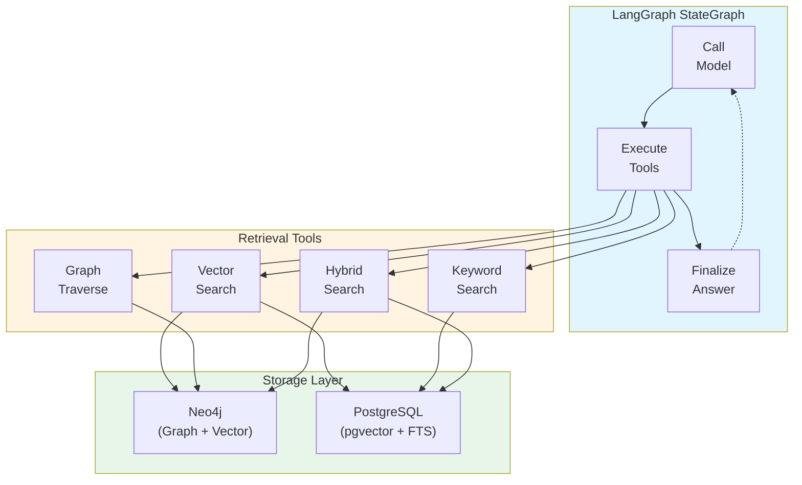

# Agentic GraphRAG for Test Scope Analysis

[](https://github.com/yourusername/agentic-rag-test-scope-analysis)
[](LICENSE)
[](https://www.python.org/downloads/)
[](https://github.com/psf/black)
[](https://github.com/astral-sh/ruff)

> **Master's Thesis Research Project**  
> Conducted in collaboration with **Ericsson**  
> Linköping University, 2024-2025

A research implementation of an agentic Retrieval-Augmented Generation (RAG) system combining Knowledge Graphs, Vector Search, and Human-in-the-Loop workflows for test scope analysis in telecommunications software systems.

## ⚠️ Academic Research Project

This repository contains the implementation for a Master's Thesis. The code is made publicly available for:
- Academic transparency and reproducible research
- Peer review and thesis evaluation
- Educational purposes and research community benefit

**Important**: This is a research artifact, not a production-ready commercial product. See [LICENSE](LICENSE), [DISCLAIMER.md](DISCLAIMER.md), and [CONTRIBUTING.md](CONTRIBUTING.md) for usage terms and restrictions.

## Overview

This system implements a comprehensive agentic RAG architecture that addresses three key research questions:

- **RQ1**: What Knowledge Graph ontology effectively represents software engineering entities and relationships for test scope analysis?
- **RQ2**: How do different retrieval strategies (vector, keyword, graph, hybrid) compare for test-related queries?
- **RQ3**: How can Human-in-the-Loop (HITL) agent workflows improve retrieval quality and user control?

## Key Features

- **Custom LangGraph Agent**: Full control over ReAct loop with StateGraph
- **Dual Storage Architecture**: Neo4j (graph + vectors) + PostgreSQL (vectors + full-text search)
- **4 Retrieval Tools**:
  - Vector Search (semantic similarity)
  - Keyword Search (lexical matching)
  - Graph Traversal (structural dependencies)
  - Hybrid Search (RRF fusion)
- **LangSmith Integration**: Full observability and debugging
- **HITL Workflows**: PostgresSaver checkpointing for human intervention
- **Evaluation Metrics**: Precision@k, Recall@k, MAP, MRR

## Architecture



## Installation

### Prerequisites

- Python 3.11+
- Neo4j 5.20+ (with APOC and GDS plugins)
- PostgreSQL 15+ with pgvector extension
- Poetry 1.8+

### Setup

1. Clone the repository:
```bash
git clone <repository-url>
cd agentic-rag-test-scope-analysis
```

2. Install dependencies with Poetry:
```bash
poetry install
```

3. Create environment file:
```bash
cp .env.example .env
# Edit .env with your API keys and database credentials
```

4. Initialize database schemas:
```bash
poetry run agrag init
```

## Configuration

See `.env.example` for all configuration options. Key settings:

- `GOOGLE_API_KEY`: Required for LLM and embeddings
- `NEO4J_URI`, `NEO4J_PASSWORD`: Neo4j connection
- `NEON_CONNECTION_STRING`: PostgreSQL/Neon connection
- `LANGCHAIN_API_KEY`: Optional, for LangSmith tracing

## Usage

### CLI Commands

#### Interactive Chat (Recommended)
```bash
# Start interactive chat mode (like Claude Code, Copilot CLI)
# Safe by default - you approve each tool before execution
poetry run agrag chat

# Resume a previous conversation
poetry run agrag chat --thread-id my-session

# YOLO mode - autonomous execution without approvals (use with caution)
poetry run agrag chat --yolo
```

The interactive chat mode provides a conversational interface with:
- Natural language conversation
- **Automatic conversation persistence** (resume anytime)
- Real-time streaming responses with progress indicators
- Built-in commands (`/help`, `/stats`, `/exit`, etc.)
- **Safe by default** - you approve each tool execution (HITL mode)

**Modes:**
- **Default (Safe Mode)**: Agent asks for approval before each tool execution
  - ✅ You control everything, safer, better for learning
  - Best for: normal usage, exploring, sensitive data
  
- **YOLO Mode** (`--yolo`): Agent executes autonomously without asking
  - ⚡ Faster but uncontrolled
  - Best for: trusted workflows, demos, when you're confident

**Available chat commands:**
- `/help` - Show help
- `/clear` - Clear screen
- `/history` - View conversation history
- `/stats` - Show session statistics (messages, tool calls, duration)
- `/reset` - Start new conversation
- `/save` - Save conversation to file
- `/exit` or `/quit` - Exit chat

#### Query the System
```bash
# Single query (non-interactive)
poetry run agrag query "What tests cover requirement REQ_AUTH_005?"

# With streaming output
poetry run agrag query "Find handover-related test cases" --stream

# With HITL checkpointing
poetry run agrag query "Show dependencies for TestLoginTimeout" --checkpoint --thread-id my-session
```

#### Initialize Databases
```bash
poetry run agrag init
```

#### Run Evaluation
```bash
poetry run agrag evaluate --dataset data/eval_queries.json --output results.json
```

#### Show Configuration
```bash
poetry run agrag info
```

### Programmatic Usage

```python
from agrag.core import create_agent_graph, create_initial_state
from agrag.storage import Neo4jClient, PostgresClient

# Create agent
graph = create_agent_graph()

# Run query
initial_state = create_initial_state("Find tests for handover failures")
result = graph.invoke(initial_state)

print(result["final_answer"])
```

## Knowledge Graph Ontology

The system uses a custom ontology for software engineering entities:

### Entity Types
- **Requirement**: System requirements with priorities
- **TestCase**: Test cases (unit, integration, protocol, etc.)
- **Function**: Code functions with signatures
- **Class**: Code classes with methods
- **Module**: Code modules/packages

### Relationship Types
- **VERIFIES**: TestCase → Requirement
- **COVERS**: TestCase → Function/Class
- **CALLS**: Function → Function
- **DEFINED_IN**: Function/Class → Module
- **INHERITS_FROM**: Class → Class
- **DEPENDS_ON**: Requirement → Requirement

## Retrieval Tools

### 1. Vector Search
Semantic search using Neo4j vector indexes (768-dim embeddings).

**Best for:**
- Conceptual queries
- Finding semantically similar content
- Understanding meanings and intent

**Example:**
```python
from agrag.tools import VectorSearchTool

tool = VectorSearchTool()
result = tool.invoke({
    "query": "tests related to handover failures",
    "k": 10,
    "node_type": "TestCase"
})
```

### 2. Keyword Search
Lexical search using PostgreSQL full-text search (ts_rank_cd).

**Best for:**
- Exact keyword matches
- Specific identifiers (test IDs, function names)
- Error codes and technical terms

**Example:**
```python
from agrag.tools import KeywordSearchTool

tool = KeywordSearchTool()
result = tool.invoke({
    "query": "TestLoginTimeout",
    "k": 10
})
```

### 3. Graph Traversal
Multi-hop graph traversal for structural relationships.

**Best for:**
- Dependency analysis
- Coverage tracing
- Structural queries

**Example:**
```python
from agrag.tools import GraphTraverseTool
from agrag.kg.ontology import NodeLabel, RelationshipType

tool = GraphTraverseTool()
result = tool.invoke({
    "start_node_id": "REQ_AUTH_005",
    "start_node_label": NodeLabel.REQUIREMENT,
    "relationship_types": [RelationshipType.VERIFIES],
    "depth": 2
})
```

### 4. Hybrid Search
RRF fusion of vector + keyword search.

**Best for:**
- Complex queries needing both semantic and lexical matching
- Balancing precision and recall

**Example:**
```python
from agrag.tools import HybridSearchTool

tool = HybridSearchTool()
result = tool.invoke({
    "query": "tests for LTE signaling with timeout errors",
    "k": 10,
    "rrf_k": 60
})
```

## Evaluation

The system includes comprehensive evaluation metrics:

- **Precision@k**: Relevant items in top-k
- **Recall@k**: Coverage of relevant items
- **F1@k**: Harmonic mean of precision and recall
- **Average Precision (AP)**: Precision at each relevant position
- **Mean Average Precision (MAP)**: Average AP across queries
- **Reciprocal Rank (RR)**: Rank of first relevant item
- **Mean Reciprocal Rank (MRR)**: Average RR across queries

Example:
```python
from agrag.evaluation import evaluate_retrieval

retrieved = ["id1", "id2", "id3", "id4"]
relevant = {"id1", "id3", "id5"}

metrics = evaluate_retrieval(retrieved, relevant, k_values=[1, 3, 5, 10])
# Returns: {
#   "precision@1": 1.0,
#   "recall@1": 0.33,
#   "precision@3": 0.67,
#   ...
# }
```

## Project Structure

```
src/agrag/
├── cli/              # CLI application
├── config/           # Configuration and logging
├── core/             # StateGraph agent
│   ├── state.py      # AgentState definition
│   ├── nodes.py      # Graph nodes
│   └── graph.py      # StateGraph builder
├── data/             # Data generation and ingestion
├── evaluation/       # Evaluation metrics
├── kg/               # Knowledge graph ontology
├── models/           # LLM and embedding wrappers
├── storage/          # Database clients
│   ├── neo4j_client.py
│   └── postgres_client.py
└── tools/            # Retrieval tools
    ├── vector_search.py
    ├── keyword_search.py
    ├── graph_traverse.py
    ├── hybrid_search.py
    └── schemas.py
```

## Development

### Running Tests
```bash
poetry run pytest
```

### Code Quality
```bash
# Format code
poetry run black src/

# Lint
poetry run ruff check src/

# Type checking
poetry run mypy src/
```

## Research Questions

### RQ1: Knowledge Graph Ontology
The system implements a domain-specific ontology covering:
- 5 entity types (Requirement, TestCase, Function, Class, Module)
- 6 relationship types (VERIFIES, COVERS, CALLS, DEFINED_IN, INHERITS_FROM, DEPENDS_ON)
- Rich metadata (priorities, test types, signatures, etc.)
- Vector embeddings for all entities (768-dim)

### RQ2: Retrieval Strategy Comparison
Four retrieval strategies implemented:
- **Vector Search**: Semantic similarity (Neo4j vector index)
- **Keyword Search**: Lexical matching (PostgreSQL FTS)
- **Graph Traversal**: Structural relationships (Cypher queries)
- **Hybrid Search**: RRF fusion of vector + keyword

Evaluation framework supports comparative analysis with Precision@k, Recall@k, MAP, and MRR.

### RQ3: HITL Workflows
LangGraph StateGraph with PostgresSaver checkpointing enables:
- Conversation persistence across sessions
- Human approval before tool execution
- State inspection and modification
- Thread-based conversation management

## License

MIT License - see LICENSE file for details.

## Citation

If you use this work in your research, please cite:

```bibtex
@mastersthesis{agrag2025,
  author = {Berkay Orhan},
  title = {Agentic GraphRAG for Test Scope Analysis in Telecommunications Software},
  school = {Linköping University},
  year = {2025},
  note = {Master's Thesis, in collaboration with Ericsson},
  url = {https://github.com/yourusername/agentic-rag-test-scope-analysis}
}
```

**APA Format**:  
Orhan, B. (2025). *Agentic GraphRAG for Test Scope Analysis in Telecommunications Software* [Master's thesis, Linköping University]. GitHub. https://github.com/yourusername/agentic-rag-test-scope-analysis

## Acknowledgments

This research was conducted as part of a Master's Thesis program at Linköping University in collaboration with **Ericsson**.

**Special Thanks**:
- Ericsson Research Team
- Linköping University Department of Computer Science

## Support & Contact

This is an academic research project with limited ongoing maintenance.

**For academic questions or research collaboration**:
- Email: Berkayorhan@hotmail.se
- Student Email: Beror658@student.liu.se
- GitHub Discussions: [repository-url]/discussions

**For bug reports**:
- GitHub Issues: [repository-url]/issues

**Note**: This project follows an academic timeline. Response times may vary based on thesis schedule and defense dates.
