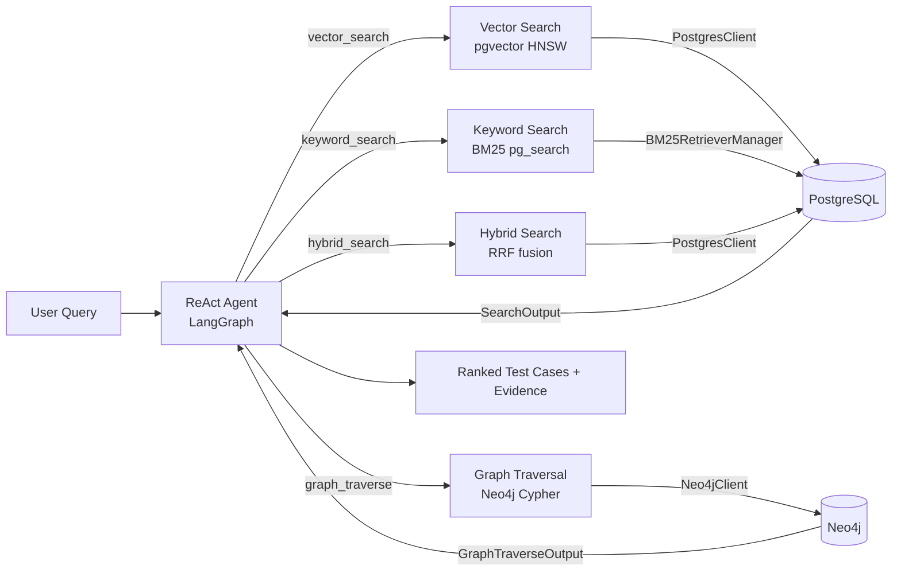
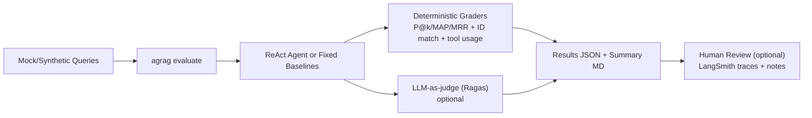

# Agentic GraphRAG for Test Scope Analysis — Supervisor Update
**Meeting date:** January 28, 2026  
**Author:** Berkay Orhan  
**Repo:** `agentic-rag-test-scope-analysis`

## TL;DR (What / Why / How)
- **What:** I built an Agentic GraphRAG system to map telecom requirements and code to relevant test cases.
- **Why:** It reduces test selection time and improves coverage traceability.
- **How:** A ReAct agent orchestrates four retrieval tools over PostgreSQL (semantic + BM25) and Neo4j (graph traversal).

---

## Agenda
1. Progress since last meeting
2. System architecture + data flow
3. Evaluation plan and current results
4. Risks / open questions
5. Next steps + feedback

---

## Progress Since Last Meeting
- Implemented **ReAct agent** with **four retrieval tools** (vector, keyword, hybrid, graph traversal)
- Built **dual‑DB pipeline**: PostgreSQL (retrieval) + Neo4j (graph)
- Added **synthetic data generator** and ingestion flow
- Integrated **evaluation metrics** (P@k, MAP, MRR)

---

## System Overview
- **Stack:** Python 3.11, Poetry, LangGraph + LangChain, Gemini, Neo4j, PostgreSQL/Neon, LangSmith
- **Agent Pattern:** ReAct agent with tool selection and reasoning
- **Ontology:** Requirement, TestCase, Function, File, Component, ChangeRequest

### Architecture (Data Flow)


---

## Evaluation Plan
**Goal:** Establish reliable regression checks now, then expand to capability evals once real data is available.  
**Dataset:** No fixed dataset yet; evaluations are currently run on **mock/synthetic queries**.  
**Metrics:** Precision@k, Recall@k, F1@k, MAP, MRR.

**Design (informed by `docs/demystifying-evals-for-ai-agents.md`):**
- Start small and early: use mock queries to define “success” before production data exists.
- Separate **regression** (high pass-rate stability checks) from **capability** (harder tasks that can evolve).
- Prefer deterministic grading first; add LLM‑as‑judge and human review where nuance is needed.

**Grader types mapped to this codebase:**
- **Code-based (deterministic):** Retrieval metrics in `src/agrag/evaluation/metrics.py`, entity-ID matching in `src/agrag/evaluation/langsmith_evaluator.py`, and tool-usage tracking in `src/agrag/evaluation/tool_tracker.py` (run via `agrag evaluate` in `src/agrag/cli/main.py`).
- **Model-based (LLM-as-judge):** Ragas metrics in `src/agrag/evaluation/ragas_metrics.py` (enabled with `--use-ragas` or LangSmith evals).
- **Human review:** Manual inspection of LangSmith experiment traces (optional `--use-langsmith`) and written summaries under `docs/evaluations/2026-01-16/`.

**Evaluation flow (simplified):**


**Example command (mock queries):**
```bash
poetry run agrag evaluate \
  --dataset <mock_queries.json> \
  --output results.json \
  --k-values "1,3,5,10"
```

---

## Current Risks / Constraints
- **No real test data yet:** I use mock/synthetic data because I do not have access to Ericsson test data or its expected format.
- **Cloud DBs are a sandbox:** Neon + Neo4j Aura are convenient for prototyping, but the production environment will likely be on‑prem or internal.
- **LLM provider mismatch:** Gemini API is not allowed at Ericsson; the final setup will use an internal model endpoint.

---

## Decisions / Feedback Needed
- Guidance on **how to obtain or approximate Ericsson test data formats** for realistic ingestion.
- Whether to **prioritize a Dockerized deployment** (Postgres + Neo4j local) for a realistic target setup.
- Confirmation that **LLM integration should shift to an OpenAI‑compatible endpoint** (via LangChain OpenAI client).

---

## Next 2–3 Weeks (Proposed)
1. Define a **representative test data schema** and ingestion contract
2. Prototype **Dockerized local stack** (Postgres + Neo4j) to mirror enterprise setup
3. Swap Gemini for **OpenAI‑compatible endpoint** via LangChain OpenAI package
4. Run comparative evaluation: hybrid vs vector-only vs keyword-only
5. Prepare a short demo script

---

## Appendix: Key Commands
```bash
poetry run agrag init
poetry run agrag generate --requirements 50 --testcases 200
poetry run agrag ingest data/synthetic_dataset.json
poetry run agrag query "tests for handover"
```
